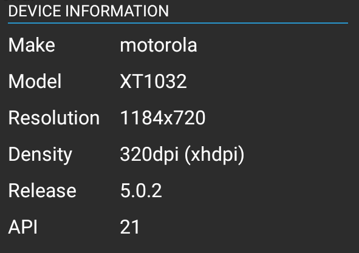
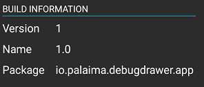
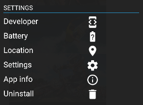
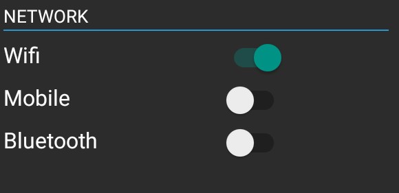
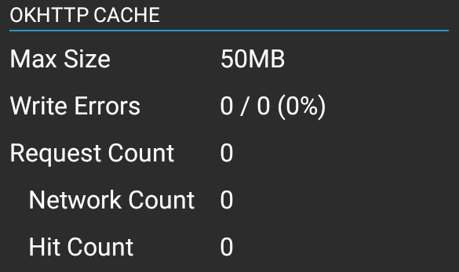
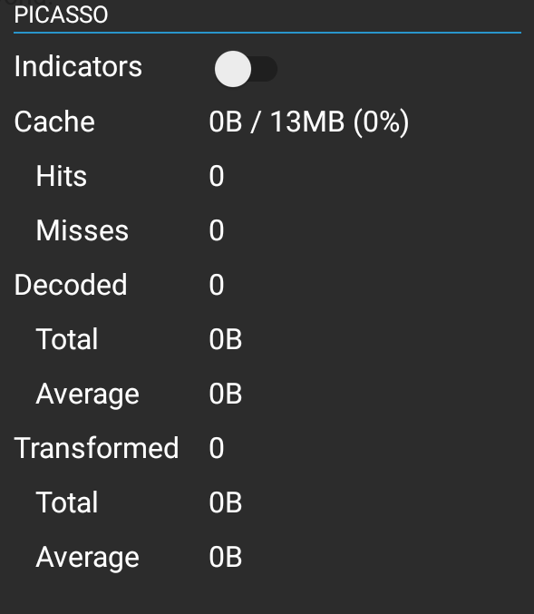
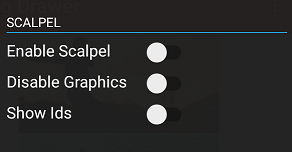
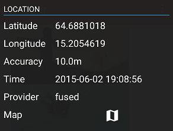
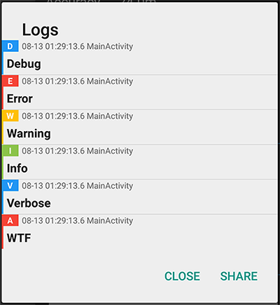
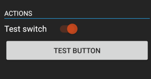

# Android Debug Drawer

[](https://gitter.im/palaima/DebugDrawer?utm_source=badge&utm_medium=badge&utm_campaign=pr-badge&utm_content=badge)

[](http://android-arsenal.com/details/1/1892)

Faster development with Debug Drawer


## Features

Currently 13 modules exist:

`DeviceModule` - common information about your device



`BuildModule` - app build information



`SettingsModule` - open Developer, Battery, Default settings, open app info and possibility to uninstall app directly from itself



`NetworkModule` - enable/disable Wifi, Mobile or Bluetooth



`OkHttpModule`,`OkHttp3Module` - common information about http client (requires extra dependency)



`PicassoModule` - image downloading and caching statistics (requires extra dependency)



`GlideModule` - image downloading and caching statistics (requires extra dependency)


`ScalpelModule` - tool to uncover the layers under your app (requires extra dependency). Thanks [ebabel](https://github.com/ebabel) for contributing.



`LocationModule` - common location information (requires extra dependency)



`TimberModule` - log viewer with sharing feature (requires extra dependency). Thanks [AntonyGolovin](https://github.com/AntonyGolovin) for contributing.



`ActionsModule` - any context dependent action (`ButtonAction`, `SwitchAction`, `SpinnerAction`)



`FpsModule` - measuring the FPS using Choreographer (requires extra dependency)


## TODO
- Network delay/error adapters
- Take screenshot feature

You are always welcome to suggest modules!

## Getting Started

Add Gradle dependencies:

#### `DebugDrawer`
```gradle
dependencies {
   debugCompile 'io.palaima.debugdrawer:debugdrawer:0.7.0'
   releaseCompile 'io.palaima.debugdrawer:debugdrawer-no-op:0.7.0'
}
```

#### `DebugView`
```gradle
dependencies {
   debugCompile 'io.palaima.debugdrawer:debugdrawer-view:0.7.0'
   releaseCompile 'io.palaima.debugdrawer:debugdrawer-view-no-op:0.7.0'
}
```

`BuildModule`, `DeviceModule`, `SettingsModule`, `NetworkModule`
```gradle
dependencies {
   compile 'io.palaima.debugdrawer:debugdrawer-commons:0.7.0'
}
```

`ActionsModule` - `ButtonAction`, `SwitchAction`, `SpinnerAction`
```gradle
dependencies {
   compile 'io.palaima.debugdrawer:debugdrawer-actions:0.7.0'
}
```

`OkHttpModule`, `OkHttp3Module`
[OkHttp](https://github.com/square/okhttp) library required
```gradle
dependencies {
   compile 'io.palaima.debugdrawer:debugdrawer-okhttp:0.7.0'
   compile 'io.palaima.debugdrawer:debugdrawer-okhttp3:0.7.0'
}
```

`PicassoModule`
[Picasso](https://github.com/square/picasso) library required
```gradle
dependencies {
   compile 'io.palaima.debugdrawer:debugdrawer-picasso:0.7.0'
}
```

`GlideModule`
[Glide](https://github.com/bumptech/glide) library required
```gradle
dependencies {
   compile 'io.palaima.debugdrawer:debugdrawer-glide:0.7.0'
}
```

`ScalpelModule`
[Scalpel](https://github.com/JakeWharton/scalpel) library required
```gradle
dependencies {
   compile 'io.palaima.debugdrawer:debugdrawer-scalpel:0.7.0'
}
```

`LocationModule`
```gradle
dependencies {
   compile 'io.palaima.debugdrawer:debugdrawer-location:0.7.0'
}
```

`TimberModule`
[Timber](https://github.com/JakeWharton/timber) library required
```gradle
dependencies {
   compile 'io.palaima.debugdrawer:debugdrawer-timber:0.7.0'
}
```

`FpsModule`
[Takt](https://github.com/wasabeef/Takt) library required
```gradle
dependencies {
   compile 'io.palaima.debugdrawer:debugdrawer-fps:0.7.0'
}
```

You can try the SNAPSHOT version:

```gradle
dependencies {
   debugCompile 'io.palaima.debugdrawer:debugdrawer:0.7.1-SNAPSHOT'
   ...
}
```
Make sure to add the snapshot repository:

```gradle
repositories {
    maven {
        url "https://oss.sonatype.org/content/repositories/snapshots"
    }
}
```

## Putting All Together

### 1. Initialization in Activity

You could use `DebugDrawer` or `DebugView` depending on your needs

#### Example using `DebugDrawer` (For `DebugView` initialization check [DebugViewActivity](https://github.com/palaima/DebugDrawer/blob/master/app/src/main/java/io/palaima/debugdrawer/app/DebugViewActivity.java))

```java

    private DebugDrawer debugDrawer;

    @Override
    protected void onCreate(Bundle savedInstanceState) {
        super.onCreate(savedInstanceState);
        // ...

        SwitchAction switchAction = new SwitchAction("Test switch", new SwitchAction.Listener() {
            @Override
            public void onCheckedChanged(boolean value) {
                Toast.makeText(MainActivity.this, "Switch checked", Toast.LENGTH_LONG).show();
            }
        });

        ButtonAction buttonAction = new ButtonAction("Test button", new ButtonAction.Listener() {
            @Override
            public void onClick() {
                Toast.makeText(MainActivity.this, "Button clicked", Toast.LENGTH_LONG).show();
            }
        });

        SpinnerAction<String> spinnerAction = new SpinnerAction<>(
            Arrays.asList("First", "Second", "Third"),
            new SpinnerAction.OnItemSelectedListener<String>() {
                @Override public void onItemSelected(String value) {
                    Toast.makeText(MainActivity.this, "Spinner item selected - " + value, Toast.LENGTH_LONG).show();
                }
            }
        );

        debugDrawer = new DebugDrawer.Builder(this)
            .modules(
                new ActionsModule(switchAction, buttonAction, spinnerAction),
                new FpsModule(Takt.stock(getApplication())),
                new LocationModule(this),
                new ScalpelModule(this),
                new TimberModule(),
                new OkHttp3Module(okHttpClient),
                new PicassoModule(picasso),
                new GlideModule(Glide.get(getContext())),
                new DeviceModule(this),
                new BuildModule(this),
                new NetworkModule(this),
                new SettingsModule(this)
            ).build();
    }
```

### 2. Lifecycle
If you use `NetworkModule`, `LocationModule`, `FpsModule` or your own which is hooked with BroadcastReceivers you must call `onStart`/`onStop`, `onResume`/`onPause` in your activity

```java

    @Override
    protected void onStart() {
        super.onStart();
        debugDrawer.onStart();
    }

    @Override
    protected void onResume() {
        super.onResume();
        debugDrawer.onResume();
    }

     @Override
    protected void onPause() {
        super.onPause();
        debugDrawer.onPause();
    }

    @Override
    protected void onStop() {
        super.onStop();
        debugDrawer.onStop();
    }
```

### 3. `TimberModule`
Don't forget to plant needed log trees in Application class. Tree that is used by `TimberModule` stored in `LumberYard` class.

Application class example:

```java

    public class DebugDrawerApplication extends Application {
        @Override
        public void onCreate() {
            super.onCreate();

            LumberYard lumberYard = LumberYard.getInstance(this);
            lumberYard.cleanUp();

            Timber.plant(lumberYard.tree());
            Timber.plant(new Timber.DebugTree());
        }
    }
```

## Creating and Publishing Your Own Module

Add `compile 'io.palaima.debugdrawer:debugdrawer-base:0.7.0'` to your dependencies

Module must implement `DebugModule` interface

```java

    public interface DebugModule {

        /**
         * Creates module view
         */
        @NonNull View onCreateView(@NonNull LayoutInflater inflater, @NonNull ViewGroup parent);

        /**
         * Override this method if you need to refresh
         * some information  when drawer is opened
         */
        void onOpened();

        /**
         * Override this method if you need to stop
         * some actions  when drawer is closed
         */
        void onClosed();

        /**
         * Override this method if you need to start
         * some processes
         */
        void onResume();

        /**
         * Override this method if you need to do
         * some clean up
         */
        void onPause();

        /**
         * Override this method if you need to start
         * some processes that would be killed when
         * onStop() is called
         * E.g. register receivers
         */
        void onStart();

        /**
         * Override this method if you need to do
         * some clean up when activity goes to foreground.
         * E.g. unregister receivers
         */
        void onStop();
    }
```

## Sample

You can clone the project and compile it yourself (it includes a sample).

[MainActivity](https://github.com/palaima/DebugDrawer/blob/master/app/src/main/java/io/palaima/debugdrawer/app/MainActivity.java)

[DebugViewActivity](https://github.com/palaima/DebugDrawer/blob/master/app/src/main/java/io/palaima/debugdrawer/app/DebugViewActivity.java)

## Contributing
Want to contribute? You are welcome!

### Pull Requests
* Fork the repo and create your branch from `dev`.
* If you've changed APIs, update the documentation.
* Make sure your code lints.
* Change README.md if necessary

### Coding Style
* Opening braces to appear on the same line as code
* All variables must be `camelCase`
* All resources must have `dd_` prefix

Developed By
------------

* Mantas Palaima - <palaima.mantas@gmail.com>

Credits
------------

* Jake Wharton - [U2020](https://github.com/JakeWharton/u2020)

* Mike Penz - [MaterialDrawer](https://github.com/mikepenz/MaterialDrawer)

* LemonLabs - [SlidingDebugMenu](https://github.com/lemonlabs/slidingdebugmenu)

License
--------

    Copyright 2016 Mantas Palaima.

    Licensed under the Apache License, Version 2.0 (the "License");
    you may not use this file except in compliance with the License.
    You may obtain a copy of the License at

       http://www.apache.org/licenses/LICENSE-2.0

    Unless required by applicable law or agreed to in writing, software
    distributed under the License is distributed on an "AS IS" BASIS,
    WITHOUT WARRANTIES OR CONDITIONS OF ANY KIND, either express or implied.
    See the License for the specific language governing permissions and
    limitations under the License.
